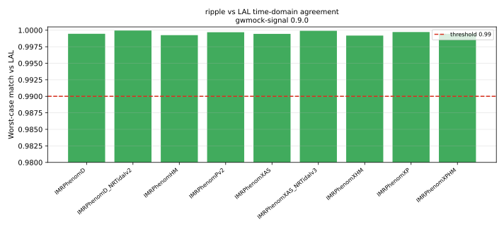

# Consistency

The [ripple](../user_guide/waveform.md) (JAX) backend is an alternative
implementation of the same waveform models LAL provides. This page tracks their
agreement so the JAX/GPU path can be trusted against the LAL baseline.

## What is measured

For every approximant that LAL implements in the time domain, the white,
time/phase-maximized **match** between the ripple and LAL backends is computed
for both polarizations across several parameter sets; the **worst-case** and
**median** match per approximant are recorded (with the released version that
produced them).

`TaylorF2` is covered separately by the test suite — LAL provides no time-domain
TaylorF2, so it is anchored against LAL's _frequency-domain_ TaylorF2.

## Reproducing

```bash
uv run --extra jax python benchmarks/run_consistency_benchmark.py \
    --output-json benchmarks/results/consistency.json

uv run python benchmarks/plot_consistency.py \
    --results-json benchmarks/results/consistency.json
```

## Results

Run on **gwmock-signal 0.9.0**. The ripple and LAL backends agree to a
**worst-case match of 0.9992** across all approximants (`IMRPhenomXHM`); every
median match is ≥ 0.9996. `TaylorF2` is anchored against LAL's frequency-domain
TaylorF2 in the test suite (no time-domain LAL implementation).



| Approximant              | f_min [Hz] | worst match | median match |
| ------------------------ | ---------: | ----------: | -----------: |
| `IMRPhenomD`             |         20 |     0.99946 |      0.99975 |
| `IMRPhenomD_NRTidalv2`   |         40 |     0.99995 |      0.99997 |
| `IMRPhenomHM`            |         20 |     0.99925 |      0.99970 |
| `IMRPhenomPv2`           |         20 |     0.99969 |      0.99975 |
| `IMRPhenomXAS`           |         20 |     0.99944 |      0.99974 |
| `IMRPhenomXAS_NRTidalv3` |         40 |     0.99990 |      0.99996 |
| `IMRPhenomXHM`           |         20 |     0.99918 |      0.99958 |
| `IMRPhenomXP`            |         20 |     0.99972 |      0.99975 |
| `IMRPhenomXPHM`          |         20 |     0.99945 |      0.99956 |

The residual ~1e-3 gap is dominated by the device path's on-device sidereal-time
model (default leap seconds, `dut1 = 0`); see
[Batched GPU simulation](../user_guide/gpu-batched-simulation.md).
