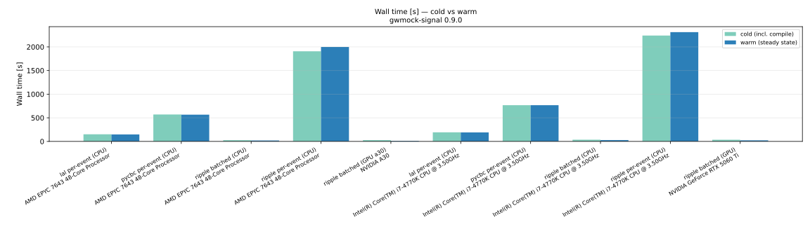
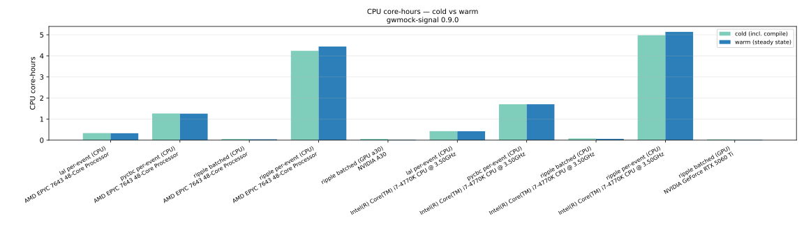
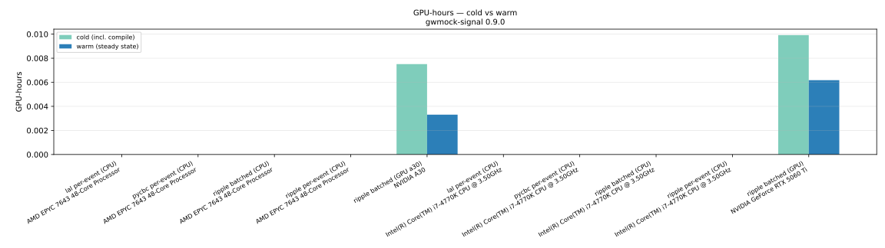
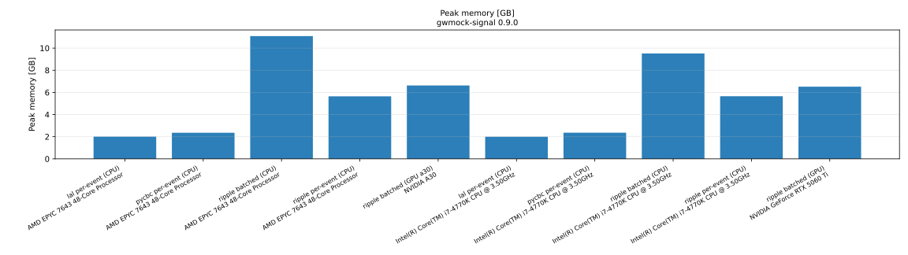
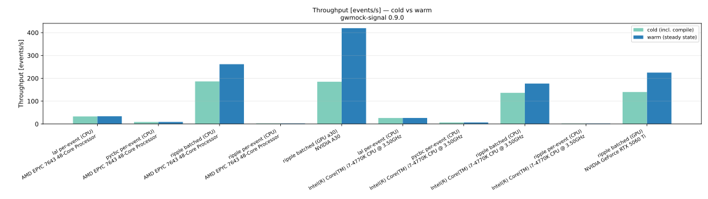

# Performance

These benchmarks compare the cost of generating a CBC catalogue data product
across **backends** (`lal`, `pycbc`, `ripple`), **methods** (per-event vs the
batched on-device path, see
[Batched GPU simulation](../user_guide/gpu-batched-simulation.md)), and
**hardware** (CPU and GPU nodes). They are produced by the scripts in
[`benchmarks/`](https://github.com/Leuven-Gravity-Institute/gwmock-signal/tree/main/benchmarks)
and are reproducible.

## Metrics

Each run records, with full provenance (the released `gwmock-signal` version,
the CPU/GPU model, and library versions):

- **Wall time** — end-to-end seconds to produce the catalogue.
- **CPU core-hours / GPU-hours** — wall time × allocated CPU cores (or GPUs).
- **Peak / average memory** — resident set size (and peak GPU memory where
  present).
- **Output-data size** — bytes of the produced data segments.
- **Throughput** — events per second.

## Reproducing

Run one configuration per invocation, then aggregate:

```bash
uv run --extra jax python benchmarks/run_performance_benchmark.py \
    --backend ripple --method batched --n-events 5000 \
    --output-json benchmarks/results/ripple_gpu.json --label "ripple batched (GPU)"

uv run python benchmarks/plot_performance.py --results-dir benchmarks/results
```

See
[`benchmarks/README.md`](https://github.com/Leuven-Gravity-Institute/gwmock-signal/tree/main/benchmarks)
for the full matrix and the cluster submission templates.

## Results

!!! note "Populated per release"

    The figures below are generated from runs on **released** versions (each figure
    is annotated with the `gwmock-signal` version and the CPU/GPU model that produced
    it). They are added/refreshed after a release benchmark campaign.

<!-- The release benchmark run adds the figures here, e.g.:





-->
