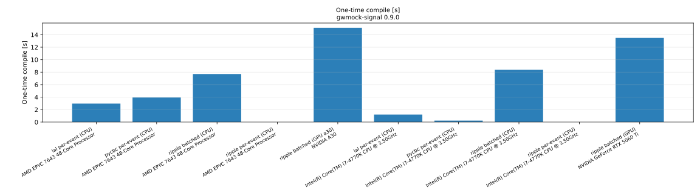
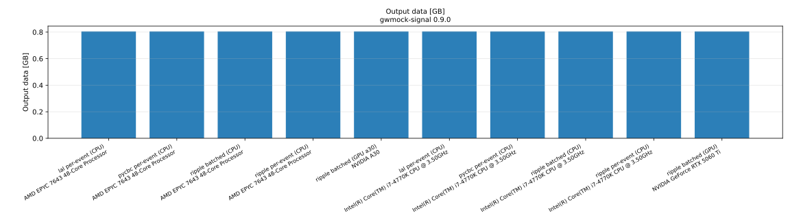

# Performance

These benchmarks compare the cost of generating a CBC catalogue data product
across **backends** (`lal`, `pycbc`, `ripple`), **methods** (per-event vs the
batched on-device path, see
[Batched GPU simulation](../user_guide/gpu-batched-simulation.md)), and
**hardware** (CPU and GPU nodes). They are produced by the scripts in
[`benchmarks/`](https://github.com/Leuven-Gravity-Institute/gwmock-signal/tree/main/benchmarks)
and are reproducible.

## Metrics

Each run produces the catalogue **twice** — a **cold** run that pays one-time
JIT/XLA compilation and a **warm** steady-state run — and records, with full
provenance (the released `gwmock-signal` version, the CPU/GPU model, and library
versions):

- **Wall time (cold / warm)** — end-to-end seconds, before and after
  compilation.
- **Compile time** — `cold − warm`, the one-time cost a production-scale
  catalogue amortizes away. (The eager per-event path has no JIT, so cold ≈
  warm.)
- **CPU core-hours / GPU-hours (cold / warm)** — wall time × allocated CPU cores
  (or GPUs).
- **Peak / average memory** — peak resident set across both runs, average over
  the warm run (and peak GPU memory where present).
- **Output-data size** — bytes of the produced data segments.
- **Throughput (cold / warm)** — events per second.

The headline comparison is the **warm** throughput: at catalogue scale the
compile cost vanishes, so steady state is what a year-long run actually sees.
The cold bars are kept beside it because the GPU's compile is larger than the
CPU's, which can mask the device's advantage at small event counts.

## Reproducing

Run one configuration per invocation, then aggregate:

```bash
uv run --extra jax python benchmarks/run_performance_benchmark.py \
    --backend ripple --method batched --n-events 5000 \
    --output-json benchmarks/results/ripple_gpu.json --label "ripple batched (GPU)"

uv run python benchmarks/plot_performance.py --results-dir benchmarks/results
```

See
[`benchmarks/README.md`](https://github.com/Leuven-Gravity-Institute/gwmock-signal/tree/main/benchmarks)
for the full matrix and the cluster submission templates.

## Results

Run on **gwmock-signal 0.9.0**: 5000 events, `IMRPhenomD`, network H1/L1/V1, 128
× 64 s segments (≈0.8 GB data product). CPU runs used 8 cores; GPU runs one GPU.
Numbers are **warm** (steady state) unless stated; `cold` includes the one-time
compile.

### AMD EPYC 7643 (CPU) + NVIDIA A30 (GPU)

| cell               | device             | warm ev/s | cold/warm wall (s) | compile (s) | peak mem (GB) | output (GB) |
| ------------------ | ------------------ | --------: | -----------------: | ----------: | ------------: | ----------: |
| lal per-event      | AMD EPYC 7643 (×8) |        34 |          151 / 148 |         3.0 |           2.0 |        0.81 |
| pycbc per-event    | AMD EPYC 7643 (×8) |         9 |          569 / 566 |         3.9 |           2.4 |        0.81 |
| ripple per-event   | AMD EPYC 7643 (×8) |         3 |        1907 / 1999 |         0.0 |           5.6 |        0.81 |
| ripple batched     | AMD EPYC 7643 (×8) |       262 |            27 / 19 |         7.7 |          11.1 |        0.81 |
| **ripple batched** | **NVIDIA A30**     |   **420** |            27 / 12 |        15.1 |           6.6 |        0.81 |

### Intel i7-4770K (CPU) + NVIDIA RTX 5060 Ti (GPU)

| cell             | device              | warm ev/s | cold/warm wall (s) | compile (s) | peak mem (GB) | output (GB) |
| ---------------- | ------------------- | --------: | -----------------: | ----------: | ------------: | ----------: |
| lal per-event    | Intel i7-4770K (×8) |        26 |          192 / 191 |         1.2 |           2.0 |        0.81 |
| pycbc per-event  | Intel i7-4770K (×8) |         7 |          767 / 767 |         0.2 |           2.4 |        0.81 |
| ripple per-event | Intel i7-4770K (×8) |         2 |        2240 / 2312 |         0.0 |           5.7 |        0.81 |
| ripple batched   | Intel i7-4770K (×8) |       177 |            37 / 28 |         8.4 |           9.5 |        0.81 |
| ripple batched   | NVIDIA RTX 5060 Ti  |       225 |            36 / 22 |        13.5 |           6.5 |        0.81 |

### What the numbers say

- **The batched path is the point.** On the same EPYC node, batched ripple is
  **~80× faster** than ripple per-event (262 vs 3 ev/s) and clears the LAL/PyCBC
  per-event baselines (34 / 9 ev/s) by ~8–30×. Per-event ripple is the _slowest_
  path — it runs eager (no JIT), paying JAX dispatch on every call; it exists
  for parity, not for throughput.
- **GPU wins in steady state, but only there.** The A30 reaches 420 ev/s warm vs
  the 8-core EPYC's 262 (~1.6×). In the **cold** numbers the two are
  indistinguishable (~27 s each) because the GPU's compile (15 s) is ~2× the
  CPU's (8 s) — at 5000 events that one-time cost cancels the device advantage.
  It amortizes away at catalogue scale, which is why warm is the headline.
- **Compile is real and device-dependent.** It is ~0 for the eager per-event
  paths, a few seconds for batched CPU, and largest on GPU.




??? note "More metrics (core-hours, memory, output size)"

    

    

    

    

!!! warning "Caveats"

    Absolute compile seconds vary run-to-run and could not be anchored to an
    external reference. GPU runs were pinned to Ampere or newer — a Turing card
    (RTX 2080 Ti) was observed to stall XLA compilation for hours. These figures
    are a fixed-scale snapshot (5000 events); GPU's relative advantage grows with
    catalogue size as the compile amortizes.
